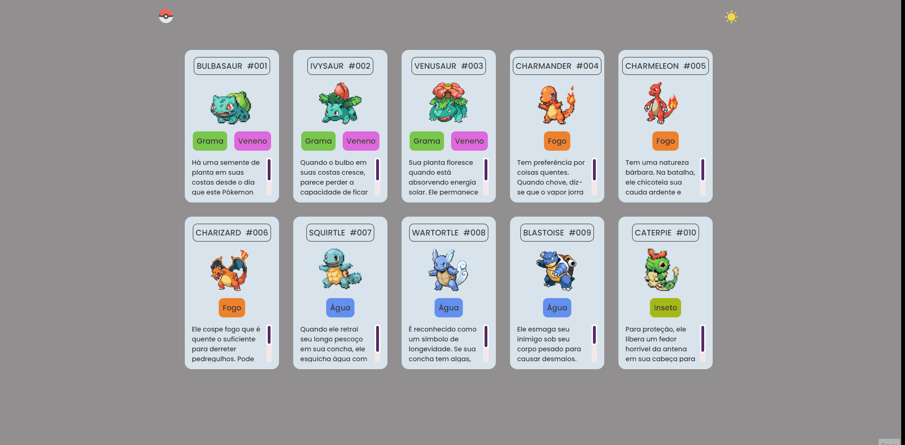

<h1 align="center"> Pokédex </h1>

Pokédex Simples

  <a href="#-tecnologias">Tecnologias</a>&nbsp;&nbsp;&nbsp;|&nbsp;&nbsp;&nbsp;
  <a href="#-projeto">Projeto</a>&nbsp;&nbsp;&nbsp;|&nbsp;&nbsp;&nbsp;
  <a href="#-dependências">Dependências</a>&nbsp;&nbsp;&nbsp;|&nbsp;&nbsp;&nbsp;
  <a href="#-licença">Licença</a>&nbsp;&nbsp;&nbsp;|&nbsp;&nbsp;&nbsp;

  

 

  

## 🚀 Tecnologias

Esse projeto foi desenvolvido com as seguintes tecnologias:

- HTML e CSS
- JavaScript

## 💻 Projeto

Este projeto é uma Pokédex simples que permite aos usuários visualizar informações básicas sobre diferentes Pokémon. A Pokédex exibe uma lista de Pokémon com detalhes como nome, número de identificação, tipo e uma breve descrição de cada um.

A interface é simples e direta, apresentando os Pokémon de forma sequencial, sem a funcionalidade de pesquisa. O objetivo é fornecer uma ferramenta acessível para explorar informações essenciais sobre os Pokémon de maneira prática e rápida.

Este projeto utiliza JavaScript para gerenciar a exibição dos dados, proporcionando uma experiência fluida e eficiente.

## 📝 Licença

Esse projeto está sob a licença MIT.
